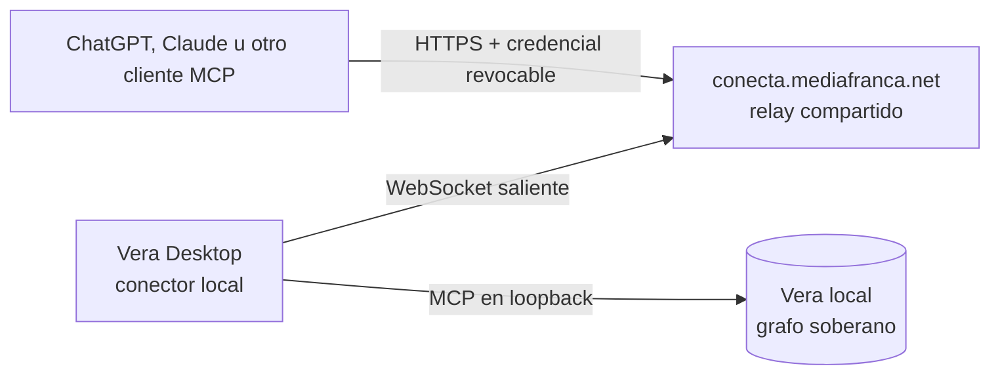

# Vera Conecta

Vera Conecta es el puente comunitario entre una instalación local de
[Vera](https://github.com/mediafranca/vera) y una inteligencia artificial que
vive en Internet. Vera Desktop abre una conexión saliente hacia un relay
compartido de MediaFranca; la persona no instala Cloudflare, no compra un
dominio, no abre puertos y no publica su biblioteca.

> La documentación canónica para personas estará en
> [VERA Conecta](https://vera.mediafranca.net/vera-conecta/). Mientras esa página
> termina de publicarse, este repositorio conserva el contrato técnico y el
> estado comprobable de la implementación.



El relay transporta solicitudes mientras Vera está conectada. No aloja una
copia del grafo, no recibe las claves de OpenAI o Anthropic y no compra
inferencia. La suscripción y la conversación siguen perteneciendo al cliente de
IA; la memoria, la autoridad y la procedencia permanecen en Vera.

## Para quién es cada documento

- **Personas usuarias:** [guía de uso y conexión de una IA](docs/11-guia-de-uso.md).
- **Operadores de MediaFranca o de una instancia propia:**
  [despliegue del servicio](docs/12-despliegue-del-servicio.md).
- **Desarrollo y revisión de seguridad:** [índice técnico](#documentación-técnica),
  specs Allium y ADR.
- **Explicación pública y filosofía:**
  [página canónica en Vera](https://vera.mediafranca.net/vera-conecta/).

## Decisión de producto

El camino predeterminado será el relay compartido de la comunidad en
`conecta.mediafranca.net`. Cada Vera Desktop se enlaza con él por una conexión
saliente. El autoalojamiento seguirá siendo posible para quien lo necesite, pero
no será un requisito ni la experiencia inicial.

La URL ubica una instalación; nunca autoriza por sí sola. Cada IA recibe su
propia identidad, alcances y credencial. La persona puede revocar un cliente sin
desconectar los demás.

## Estado comprobado

El relay y la interfaz de Vera Desktop están **probados localmente**, pero aún
no hay un ambiente público desplegado.

- emparejamiento de una instalación y WebSocket saliente hibernable;
- endpoint MCP remoto por instalación;
- concesiones separadas por cliente, con lectura, escritura y borrado;
- bearer manual de 90 días, mostrado una sola vez y revocable;
- interfaz Desktop para activar Conecta, autorizar, listar y revocar clientes;
- paso extremo a extremo cliente → relay → Desktop → MCP local → Vera;
- canal estrecho para Vera Clip, separado del acceso MCP general;
- 57 pruebas del relay y el empaquetado completo de Vera Desktop verificados.

Todavía faltan el despliegue en Cloudflare, una prueba externa contra
`conecta.mediafranca.net`, OAuth 2.1, streaming HTTP completo y las puertas de
seguridad de la beta.

### Compatibilidad prevista

- **Claude con cabecera fija:** el piloto bearer ya está implementado; será
  utilizable cuando el relay y una versión de Vera que incluya el conector estén
  publicados.
- **ChatGPT:** requiere el flujo OAuth 2.1 del hito M4; todavía no se ofrece como
  conexión de usuario final.
- **Otros clientes MCP:** dependerá de que admitan MCP remoto con bearer fijo o
  el OAuth que publicará Conecta. Cada cliente debe verificarse expresamente.

## Principios

1. La biblioteca permanece local y bajo autoridad de Vera.
2. Vera inicia la conexión; nunca se abre un puerto doméstico.
3. El relay minimiza metadatos y no persiste páginas, bloques, prompts ni
   respuestas MCP.
4. Cloudflare sí forma parte del trayecto y termina TLS: la promesa es
   minimización y no persistencia, no invisibilidad criptográfica del relay.
5. Una credencial por cliente permite atribuir y revocar sin compartir secretos.
6. Una operación incierta nunca se confirma como si hubiera terminado bien.

## Documentación técnica

1. [Alcance y producto](docs/01-producto.md)
2. [Modelo de dominio y recorridos](docs/02-dominio-y-recorridos.md)
3. [Arquitectura](docs/03-arquitectura.md)
4. [Contratos de transporte](docs/04-protocolo.md)
5. [Seguridad y privacidad](docs/05-seguridad-y-privacidad.md)
6. [Cloudflare y despliegue](docs/06-cloudflare.md)
7. [Operación](docs/07-operacion.md)
8. [Brief para Allium](docs/08-allium-brief.md)
9. [Plan de implementación](docs/09-plan.md)
10. [Fuentes técnicas](docs/10-fuentes.md)
11. [Guía de uso](docs/11-guia-de-uso.md)
12. [Despliegue del servicio](docs/12-despliegue-del-servicio.md)
13. [ADR 0003 — autorización sin cuenta MediaFranca](docs/decisions/0003-autorizacion-sin-cuenta-mediafranca.md)

## Desarrollo

```sh
npm install
npm run check
npm run dev
```

No ejecutar `npm run deploy:production` ni asociar el dominio sin revisión de
seguridad y autorización explícita. Los secretos se cargan mediante Wrangler;
nunca se escriben en Git, ejemplos, issues o logs.
