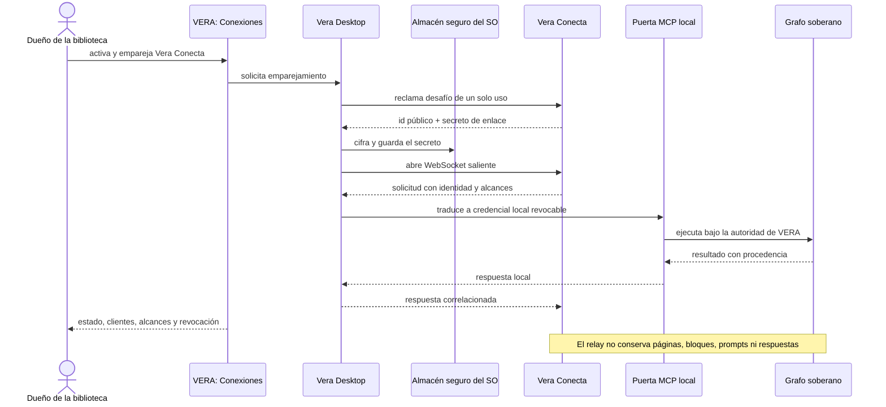

# Arquitectura

## Componentes

### Worker de borde

Termina HTTPS, valida rutas, `Origin`, autenticación, tamaños y cuotas. Resuelve
el ID público al Durable Object determinista de la instalación. Sirve además
descubrimiento OAuth, salud y una consola mínima futura.

Este componente es un **Cloudflare Worker**. No es un *Service Worker* instalado
en el navegador: la terminología se parece porque comparten APIs web, pero Vera
Conecta corre en la infraestructura de Cloudflare.

### Durable Object `InstallationRelay`

Existe uno por instalación. Mantiene la conexión WebSocket hibernable de Vera
Desktop, correlaciona solicitudes en vuelo y conserva sólo metadatos mínimos:
estado de enlace, hashes de credenciales, revocaciones, contadores y versión de
protocolo. Usa almacenamiento SQLite del Durable Object.

### Conector de Vera Desktop

Se incorpora al producto Vera, no a este Worker. Mantiene reconexión con
backoff, almacena secretos en Keychain/Credential Manager/libsecret, convierte
sobres del relay en llamadas MCP a `127.0.0.1` y aplica la identidad Vera local.
Nunca escucha una interfaz pública.

El límite entre ambos repositorios queda fijado por este recorrido:

La implementación del ciclo de vida, la custodia del secreto y la traducción a
credenciales locales vive en `mediafranca/vera`. Este repositorio conserva el
contrato de red, el Worker, los Durable Objects y sus simuladores. Un cambio en
los sobres o en el emparejamiento exige actualizar y probar ambos lados antes de
declarar compatible una versión del protocolo.

Aunque hoy el conector, Vera y Cotito pueden convivir en una misma máquina,
son responsabilidades separadas. Una instancia Vera puede ejecutarse en un
equipo personal o en un anfitrión independiente sin cambiar el contrato del
relay: sólo debe mantener el enlace saliente y exponer localmente las puertas
canónicas que correspondan. Cotito es un participante de esa instancia, no una
pieza de Vera Conecta.

## Rutas previstas

- `GET /health`: salud del despliegue, sin estado de usuarios.
- `POST /pairings`: inicia emparejamiento; protegido contra abuso.
- `POST /pairings/:code/claim`: reclama una sola vez.
- `GET /v/:installation/link`: upgrade WebSocket autenticado de Desktop.
- `POST|GET|DELETE /v/:installation/mcp`: Streamable HTTP MCP.
- `POST /v/:installation/captures`: depósito estrecho de Vera Clip; autentica
  una credencial con alcance `capture`, transmite el sobre por el mismo enlace
  y nunca concede lectura del grafo ni operaciones arbitrarias.
- `/.well-known/oauth-authorization-server`: metadatos OAuth.
- `/.well-known/oauth-protected-resource`: metadatos del recurso MCP.
- `/authorize`, `/token`, `/register`: OAuth cuando se habilite.
- `POST /v/:installation/clients/:client/revoke`: control autenticado; la
  interfaz final podrá delegarlo al canal Desktop en vez de exponerlo.

## Elección de Durable Objects

El patrón dominante es una conexión persistente, casi siempre ociosa, por
instalación. WebSocket Hibernation permite sacar el objeto de memoria sin cortar
el socket. Un único objeto serializa el estado de enlace y evita coordinadores
externos. Cloud Run era viable, pero cobraría/retendría instancias por conexiones
abiertas y exigiría coordinación entre réplicas.

## Datos persistidos

Permitidos: versión, timestamps, estado, hashes con pepper de tokens, alcances,
contadores, revocaciones, IDs aleatorios y últimos códigos de error clasificados.

Prohibidos: nombres de páginas, bloques, prompts, argumentos/resultados de
herramientas, cabeceras `Authorization` originales, adjuntos, transcripciones,
secretos Vera locales y contenido de respuestas.

## Separación de ambientes

- Local: Miniflare mediante `wrangler dev`, datos descartables.
- Staging: `vera-conecta-staging.<subdomain>.workers.dev`; identidades y secretos
  distintos, sin memorias reales.
- Producción: `conecta.mediafranca.net`.

Nunca se reutilizan namespace, tokens, secretos ni datos entre ambientes. El
binding de Durable Objects se declara por ambiente porque Wrangler no lo hereda.

## Escalamiento

El ID público determina un Durable Object; por ello no hay sticky sessions
manuales. El Worker transmite cuerpos en streaming y fragmenta el WebSocket para
no retener payloads grandes en los 128 MB de memoria. Un objeto sirve una
instalación, no una organización completa.
