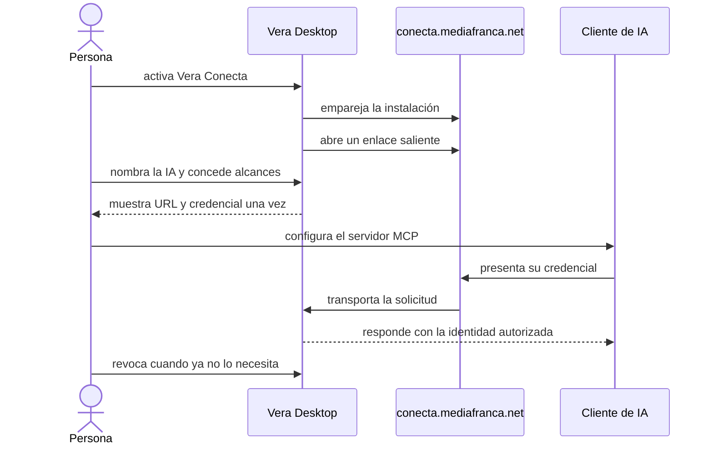

# Guía de uso

Esta guía describe la experiencia prevista del servicio compartido
`conecta.mediafranca.net`. **Todavía no es una instrucción operativa de
producción:** el relay público y la versión de Vera Desktop que contiene el
conector aún no se han publicado.

## Qué necesitas

- Vera Desktop en una versión que incluya Vera Conecta;
- una cuenta o suscripción en un cliente de IA compatible con MCP remoto;
- conexión a Internet mientras quieras que esa IA llegue a tu biblioteca.

No necesitas cuenta Cloudflare, dominio, IP pública, Tailscale ni terminal. Vera
Conecta tampoco pide la clave de OpenAI, Anthropic u otro proveedor.

## Recorrido previsto

1. Abre la página **MCP** —la puerta de Vera— en Vera Desktop.
2. En **Vera Conecta**, elige **activar Vera Conecta**.
3. Espera el estado **conectado**.
4. Nombra el cliente —por ejemplo, “Claude del notebook”— y concede sólo los
   alcances necesarios: lectura, escritura o borrado de lo propio.
5. Vera muestra una URL MCP y una credencial una sola vez. Guárdala en el
   cliente; no la pegues en notas, chats ni capturas.
6. Haz una primera consulta de identidad antes de leer o escribir.
7. Vuelve a la misma página para revisar los accesos y revocar cualquiera sin
   afectar a los demás.

## Claude: piloto con bearer

El piloto ya implementado entrega:

- URL: `https://conecta.mediafranca.net/v/<id-publico>/mcp`;
- cabecera `authorization`;
- valor `Bearer <credencial-mostrada-por-Vera>`.

La credencial dura hasta 90 días, pero puede revocarse inmediatamente desde
Vera Desktop. La configuración exacta se verificará otra vez contra el cliente
publicado antes de declarar soporte de producción.

## ChatGPT: requiere OAuth

ChatGPT no forma parte todavía del piloto de usuario final. Vera Conecta deberá
publicar descubrimiento y autorización OAuth 2.1 para que la persona pueda
aprobar el acceso desde Vera Desktop sin crear una cuenta MediaFranca. No se
debe reutilizar el bearer manual en un formulario que no permita custodiarlo o
revocarlo correctamente.

## Qué significan los alcances

- **Lectura:** buscar, recorrer y consultar el corpus.
- **Escritura:** proponer o ejecutar operaciones de escritura según las reglas
  y cercos de Vera.
- **Borrado de lo propio:** retirar contenido creado por esa identidad cuando la
  herramienta y la credencial local lo permitan. Debe concederse sólo cuando
  sea imprescindible.

Vera no confía en el nombre declarado por la IA: la credencial local y sus
alcances mandan en cada operación.

## Si Vera está cerrada o desconectada

El relay no conserva una copia utilizable de la biblioteca. El cliente recibe
un error explícito y debe esperar a que Vera Desktop vuelva a conectarse. Una
escritura cuyo resultado sea incierto no se presenta como exitosa.

## Privacidad en lenguaje directo

El contenido cruza cifrado por TLS y pasa transitoriamente por Cloudflare y el
relay. Vera Conecta no lo persiste ni lo incorpora a logs de aplicación, pero
no ofrece cifrado de extremo a extremo invisible al operador. La conversación
y el tratamiento posterior también dependen de las condiciones del proveedor
de IA escogido.

## Revocar o contener un incidente

1. Revoca el cliente desde la página **MCP** de Vera.
2. Si no reconoces varios accesos, revoca cada uno y cierra Vera Desktop para
   cortar temporalmente el enlace completo.
3. No reutilices la credencial mostrada una vez.
4. Si una operación pudo quedar en estado incierto, revisa su procedencia en
   Vera antes de repetirla.
