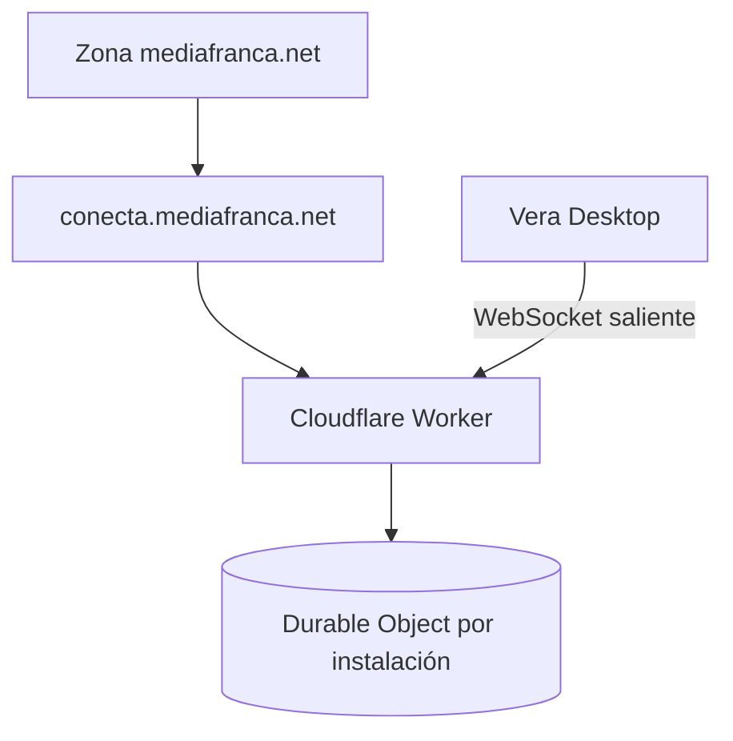

# Despliegue del servicio

Esta guía es para quien opera el relay compartido de MediaFranca o decide
autoalojar uno compatible. **No forma parte de la instalación normal de Vera.**

La receta detallada de Cloudflare está en
[`06-cloudflare.md`](06-cloudflare.md); este documento ordena el proceso y sus
puertas de seguridad.

## Topología



El dominio es una ruta personalizada del Worker dentro de la zona Cloudflare
existente. No se crea hosting tradicional ni un proxy en el notebook de
MediaFranca. Cada instalación se representa por un Durable Object y mantiene su
propio enlace saliente.

## Precondiciones

- cuenta Cloudflare que contiene la zona `mediafranca.net`;
- plan Workers compatible con Durable Objects SQLite;
- checkout limpio y commit revisado;
- Node y dependencias instaladas;
- autorización explícita para desplegar producción;
- secreto aleatorio `VERA_CONECTA_TOKEN_PEPPER` preparado fuera de Git.

## Staging

```sh
cd ~/Sites/vera-conecta
npm install
npx wrangler login
npx wrangler whoami
npm run check
npm run deploy:staging
```

Después:

1. comprobar `/health` en `vera-conecta-staging.<subdominio>.workers.dev`;
2. emparejar una Vera sin datos reales;
3. probar dos instalaciones y verificar que no pueden cruzarse;
4. crear dos clientes, revocar uno y comprobar que el otro sigue activo;
5. cortar Desktop durante una lectura y una escritura;
6. revisar que logs, errores y métricas no contienen payloads ni credenciales.

## Producción compartida

1. Cambiar producción a `workers_dev: false` y conservar el custom domain
   `conecta.mediafranca.net`.
2. Cargar `VERA_CONECTA_TOKEN_PEPPER` mediante Wrangler.
3. Ejecutar `npm run check` en el commit exacto a desplegar.
4. Desplegar con `npm run deploy:production`.
5. Verificar DNS y TLS creados por Cloudflare, sin A/CNAME duplicado.
6. Probar `/health`, emparejamiento, aislamiento, revocación, desconexión y
   rollback.
7. Registrar versión, hora, operador y resultado sin copiar secretos.

## Lo que no se configura por usuario

No se crea un Worker, un dominio ni un Durable Object manual para cada persona.
El Worker común deriva el Durable Object desde el identificador público de la
instalación. La persona sólo activa Conecta dentro de Vera Desktop.

## Autoalojamiento

Una comunidad o institución puede desplegar su propio origen compatible y
configurarlo en Vera Desktop. Debe generar secretos independientes, declarar su
propia política de privacidad y operar actualizaciones, alertas, cuotas y
respuesta a incidentes. Autoalojar no autoriza a cambiar el protocolo ni a
debilitar el aislamiento entre instalaciones.

## Rollback

Conservar la versión anterior del Worker y migraciones compatibles hacia atrás.
Un rollback no borra Durable Objects ni sus SQLite. Si una versión no puede
servir con seguridad, se suspenden escrituras antes de intentar reparaciones
destructivas.
